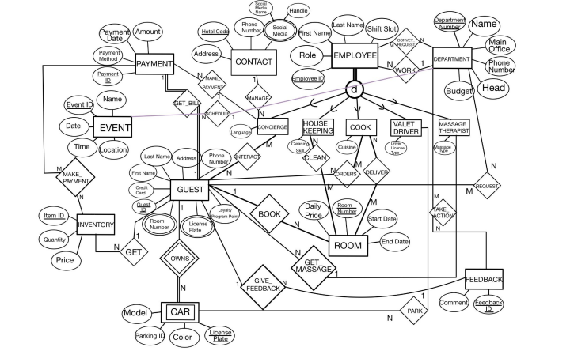

## 프로젝트 개요
 
호텔 운영을 위한 관계형 데이터베이스를 설계하고 구현한 프로젝트입니다. 게스트 관리, 예약, 직원, 결제, 피드백, 이벤트, 발렛/차량 서비스 등 호텔 운영 전반을 MySQL로 모델링했습니다.
 
개체-관계(ER) 모델링부터 스키마 정규화, 제약조건 설계, 현실적인 데이터 생성, 핵심 비즈니스 운영을 지원하는 쿼리 개발까지 데이터베이스를 처음부터 구축했습니다.
 
**팀 구성:** 4인 협업 프로젝트
 
**기술 스택:** MySQL, MySQL Workbench
 
## 주요 작업 내용
 
- 게스트, 예약, 직원, 운영 워크플로우 전반에 걸친 **26개 엔티티**를 모델링하여 관계형 데이터베이스 스키마를 설계하고, 기본키/외래키 제약조건을 통해 정규화된 설계와 참조 무결성을 보장했습니다.
- 호텔 비즈니스 로직(예: 부서별 직원 비율, 객실 대비 게스트 비율)을 기반으로 현실적인 테이블 크기를 추정하고, 이에 맞는 샘플 데이터를 생성했습니다.
- 호텔 운영에서 자주 발생하는 비즈니스 질문(입실 현황 카운트, 게스트 비용 계산, 직원 일정 등)에 답할 수 있도록 SQL 스키마, 조인, 집계 쿼리를 구현했습니다.
- 모든 스키마 변경 사항을 타임스탬프와 실행 시간과 함께 기록하는 구현 로그(Implementation Log)를 관리했습니다.
## 데이터베이스 구조
 
### ER 다이어그램
 

 
### 핵심 엔티티
 
스키마는 아래와 같이 7가지 핵심 영역을 중심으로 26개 테이블로 구성되어 있습니다.
 
| 영역 | 테이블 |
|---|---|
| 호텔/연락처 정보 | `CONTACT`, `SOCIALS` |
| 직원 관리 | `EMPLOYEE`, `DEPARTMENT`, `CONCIERGE`, `HOUSEKEEPING`, `MASSAGE_THERAPIST`, `VALET_DRIVER`, `COOK` |
| 게스트 및 예약 | `GUEST`, `ROOM`, `BOOK`, `REQUEST` |
| 결제 및 재고 | `PAYMENT`, `MAKE_PAYMENT`, `INVENTORY` |
| 서비스 및 운영 | `DELIVERS`, `ORDERS`, `CLEANS`, `CONVEY_REQUEST`, `INTERACTS`, `TAKE_ACTION` |
| 차량 | `CAR`, `CAR_PLATE` |
| 이벤트 및 피드백 | `EVENT`, `FEEDBACK` |
 
### 핵심 관계
 
- **`EMPLOYEE`는 배타적(disjoint) 슈퍼타입**으로 설계되었습니다 — 모든 직원은 `CONCIERGE`, `HOUSEKEEPING`, `COOK`, `VALET_DRIVER`, `MASSAGE_THERAPIST` 중 정확히 하나의 세부 역할 서브타입에 속합니다. 이를 통해 역할별 고유 속성(예: `Cleaning_skill`, `Cuisine`, `DLicense_type`, `Massage_type`)을 직원 공통 필드와 분리해서 중복 없이 모델링했습니다.
- **`GUEST`는 데이터베이스의 중심 엔티티**로, `ROOM`(`BOOK` 관계), `PAYMENT`(`MAKE_PAYMENT` 관계), `CAR`(`OWNS` 관계), `FEEDBACK`(`GIVE_FEEDBACK` 관계), `INVENTORY`(`GET` 관계) 등 대부분의 운영 테이블과 연결됩니다.
- **`EMPLOYEE`와 `DEPARTMENT`**는 직접 관계(`WORK`)뿐 아니라 `CONVEY_REQUEST`, `EVENT`, `TAKE_ACTION`을 통해서도 연결되어, 부서 간 협업 구조를 반영합니다.
- `ORDERS`, `DELIVERS`, `CLEANS`, `INTERACTS`, `REQUEST` 등 여러 다대다(M:N) 관계는 직원과 게스트 간의 일상적인 상호작용을 표현합니다.
각 테이블은 기본키 제약조건을 적용했으며, 엔티티 간 관계(예: `EMPLOYEE` → `DEPARTMENT`, `GUEST` → `ROOM`, `PAYMENT` → `GUEST`)는 외래키 제약조건으로 유지했습니다.
 
## 데이터 생성
 
테이블 크기는 현실적인 호텔 운영 가정(예: 가용 객실 대비 게스트 수, 부서별 직원 비율)을 기반으로 추정했습니다. 샘플 크기는 단일 행의 참조 테이블(`CONTACT`: 1행)부터 상대적으로 큰 운영 테이블(`GUEST`: 200행, `INTERACTS`: 200행, `ROOM`: 100행)까지 다양하게 구성했습니다.
 
## 쿼리 예시
 
호텔 운영에서 흔히 발생하는 비즈니스 질문에 답하는 SQL 쿼리를 아래와 같이 포함했습니다.
 
1. **최대 규모 집계** — 현재 재고에 있는 아이템 수 (`SELECT COUNT(...)`)
2. **핵심 엔티티 목록 조회** — 직원 명단 조회 (`SELECT ... FROM EMPLOYEE`)
3. **JOIN을 통한 연관 엔티티 조회** — 객실과 게스트 이름 매칭 (`ROOM JOIN GUEST`)
4. **집계 함수를 통한 비용 계산** — 게스트 숙박 총비용 (`SUM(Daily_price)`)
5. **날짜/시간순 일정 조회** — 주간 이벤트 스케줄 (`WHERE ... ORDER BY`)
## 사용 도구
 
- 스키마 설계, 쿼리 실행, 구현 로그 관리에 **MySQL Workbench** 활용
- 개발 전 과정에서 CREATE / SELECT / INSERT / UPDATE / DELETE / DROP 연산 시연
 
